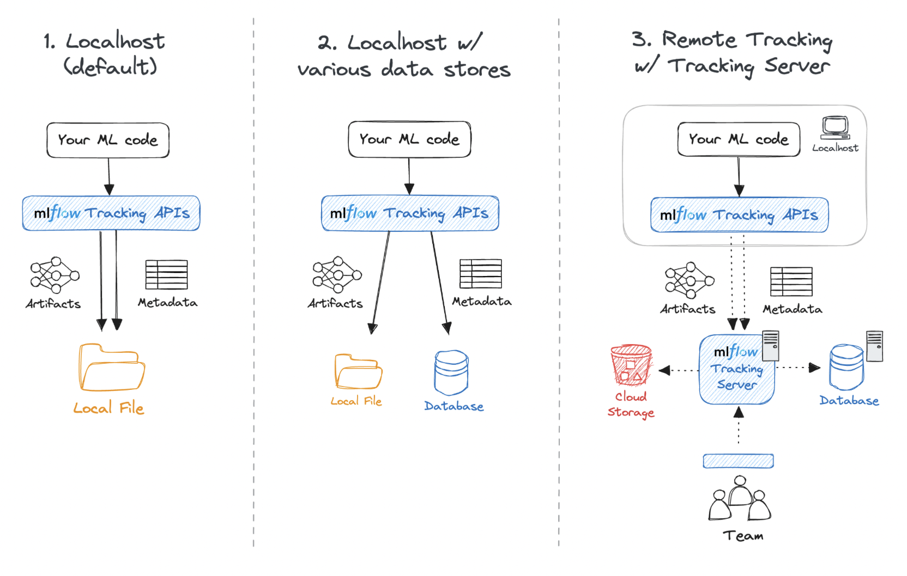

# MLflow-tutorial

mlflow ui

mlflow.set_tracking_id("...")

mlflow.set_experiment("...)

with mlflow.start_run():
    mlflow.log_metric()
    mlflow.log_param()
    mlflow.log_artifact()

Experiment vs Run 
Random forest(experiment) - param_set1(run1), param_set2(run2)
NN(experiment) - ... 
Decision tree(experiment) - ...

mlflow.set_tags({"Author": 'Vikash', "Project": 'Wine Classification'})

mlflow.sklearn.log_model(rf, "Random Forest Model")

MLFlow Server architecture(AWS vs Dagshub)

To use AWS to setup the remote mlflow server:
IAM
EC2
S3
 
Most companies use Dagshub to setup because AWS is requiring so many setups. 
